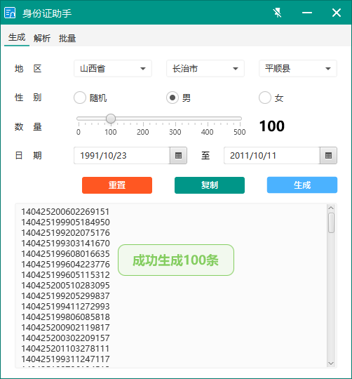
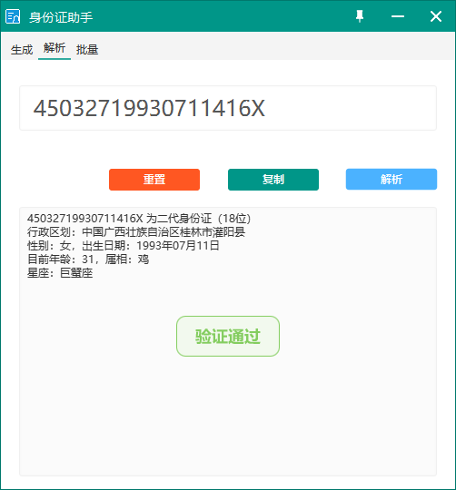
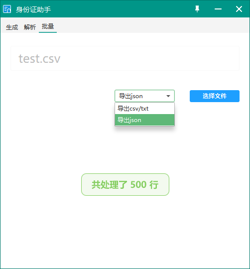

# IdCardToolsFx

## Description
A Chinese ID Card tools made by JavaFx

## Environment
build with jdk 8
run with jre 8

```bash
C:\Users\Administrator>java -version
java version "1.8.0_421"
Java(TM) SE Runtime Environment (build 1.8.0_421-b09)
Java HotSpot(TM) 64-Bit Server VM (build 25.421-b09, mixed mode)
```

**Notice: This project is only used for JavaFx GUI learning, don't use for illegal purposes. Otherwise the user assumes legal responsibility, has nothing to do with the developer.**

## Screenshot




