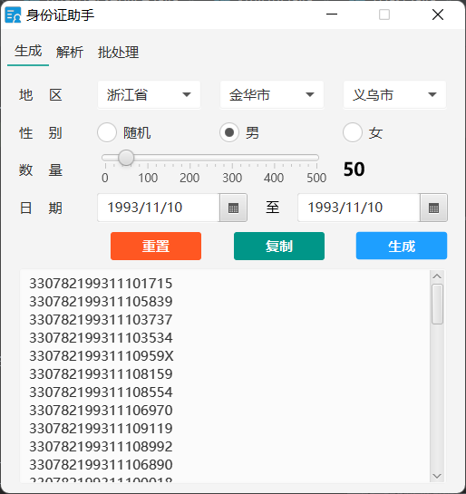
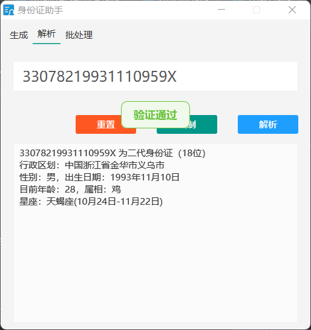

# 居民身份证小工具 IdCardToolsFx

## 介绍
使用JavaFx创建的一个身份证校验和生成小工具

```bash
C:\Users\Administrator>java -version
java version "1.8.0_421"
Java(TM) SE Runtime Environment (build 1.8.0_421-b09)
Java HotSpot(TM) 64-Bit Server VM (build 25.421-b09, mixed mode)
```

**声明：本小工具仅用作 JavaFx GUI 编程知识学习，请勿用作非法用途，否则使用者自行承担法律责任，一切与开发者无关。**


### 截图




## 功能支持：

### 生成

+ 1.省市区三级选择
+ 2.性别选择
+ 3.生成数量控制
+ 4.出生日期区间选择
+ 5.自由组合条件随机生成

### 解析

+ 1.支持18位身份证解析和校验
+ 2.支持处理15位身份证，支持升级号码
+ 3.解析项包含：一二代码/码位数/升码/行政区划/性别/年龄/出生日期/属相/星座
+ 4.区划码不存在或历史区划码，则向上级区域匹配
+ 5.支持txt文本，批量解析

### todo list

+ [x] 整理地区数据为xml文件，映射到实体工具类
+ [x] 兼容15位的一代身份证，支持升码
+ [x] 解析输入身份证限制长度
+ [x] 消息提示，实现类似安卓toast的气泡
+ [x] 生成支持出生日期时间段
+ [x] 解析时处理未匹配到行政区划的，应当向上级匹配
+ [x] 年龄计算超100或小于零的问题
+ [x] 整理idcard工具类
+ [ ] 窗口置顶
+ [ ] 系统托盘
+ [ ] 批量解析支持导入txt/csv，导出txt/csv/json格式文件
+ [ ] ~~整理历年行政区划代码，校验区划码~~

## 原理

居民身份证号码有15位和18位的，15位是一代身份证，18位是二代身份证。18位身份证号码前17位为本体码，第18位位校验码，对比15位多了年份前两位数字和最后一位校验位。现在15位的基本很少见了，在银行办理业务一般都要求先进行升码，但在数据处理中还是存在；

### 对应位含义

360825：行政区划代码，第1/2位省/直辖市/自治区级，第3/4位市级，第5/6区县级；

19231111：出生日期，年年月月日日

741：顺序码，为该地区该日出生登记的编号，男奇数，女偶数；

X：校验码

升码在第七位第八位补上19，再计算最后一位校验码，例如：

| 15位            | 18位               |
| :-------------- | ------------------ |
| 360825231111741 | 36082519231111741X |

校验码计算规则：

加权因子：weight = {7, 9, 10, 5, 8, 4, 2, 1, 6, 3, 7, 9, 10, 5, 8, 4, 2};

### 校验码表：

| 余数值 | 0    | 1    | 2    | 3    | 4    | 5    | 6    | 7    | 8    | 9    | 10   |
| ------ | ---- | ---- | ---- | ---- | ---- | ---- | ---- | ---- | ---- | ---- | ---- |
| 校验码 | 1    | 0    | X    | 9    | 8    | 7    | 6    | 5    | 4    | 3    | 2    |

身份证对应位值乘以加权因子对应位值，积的累加和除以11得余数，余数查表可得校验码；

如身份证**36082519231111741X**，本体码为**36082519231111741**，计算如下：

(3×7)+(6×9)+(0×1)+(8×5)+(2×8)+(5×4)+(1×2)+(9×1)+(2×6)+(3×3)+(1×7)+(1×9)+(1×1)+(1×5)+(7×8)+(4×4)+(1×2)=288；

乘积累加和288÷11=26余2；

2查表对应**X**

代码实现如下：

```java
/**
 * 生成校验位
 * 校验码采用《ISO 7064:1983》，MOD 11-2校验码系统；
 * 根据身份证前17位数字计算生成
 */
public static String getCheckBit(String idCardBase) {
    int[] weight = {7, 9, 10, 5, 8, 4, 2, 1, 6, 3, 7, 9, 10, 5, 8, 4, 2};
    String[] validate = {"1", "0", "X", "9", "8", "7", "6", "5", "4", "3", "2"};
    int sum = 0;
    for (int i = 0; i < 17; i++) {
        sum += (Character.getNumericValue(idCardBase.toCharArray()[i]) * weight[i]);
    }
    return validate[sum % 11];
}
```

## 参考资料：

+ 中华人民共和国民政部（行政区划代码）：http://www.mca.gov.cn/article/sj/xzqh/2020/20201201.html
+ 国家统计局（统计用区划和城乡划分代码）：http://www.stats.gov.cn/tjsj/tjbz/tjyqhdmhcxhfdm/
+ 国家标准全文公开系统（《GB11643-1999公民身份号码》）：http://www.gb688.cn/bzgk/gb/newGbInfo?hcno=080D6FBF2BB468F9007657F26D60013E